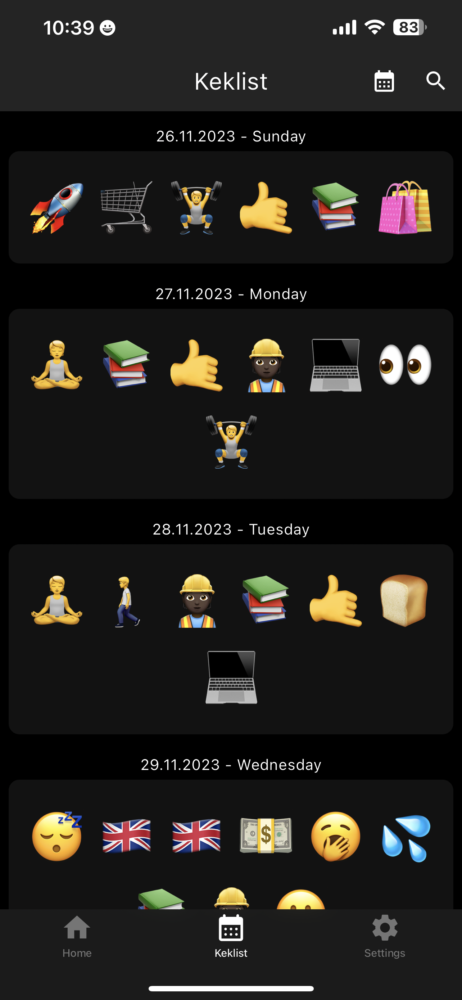
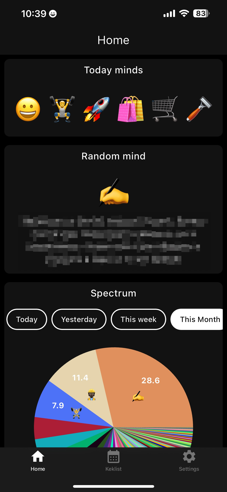
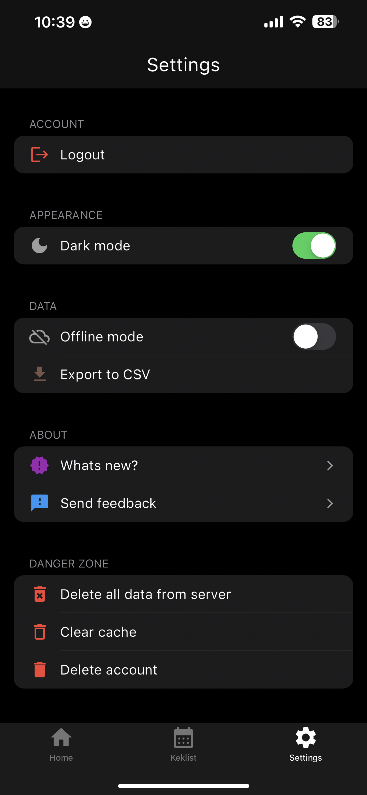

<h1 align="center" style="font-size:24px; line-height:1"><b>keklist</b></h1>

<div align="center">
  <a href="https://apps.apple.com/app/keklist/id1592891224">
    
  </a>
  <a href="https://play.google.com/store/apps/details?id=com.sashkyn.emodzen">
    
  </a>
</div>

Contents:
- What?
- Why is this project exist?
- What are main features?
- Why open-source?
- How to build?
- How to support?
- Stack

# What
keklist is app for collection minds of any types. It could be emotion, mind, something fun, spark, inspiration, achievement and even kek or lol. 

The main idea of keklist to provide easy-to-use collector of minds at the moment and analyze in the future.

Way of providing of mind it is simple - you need to have only Text and Emoji.

# Why is keklist exist?
Time is most important thing that we have in our lives because it's limited. I was woundering how can I track importance of each day.

The first thing that comes to mind is writing a diary for it. This way has a lot of problems. Main is if you do it by hand with paper and pen - it's not convenient. There are also lack of security, privacy and other problems that paper has.

Of course we have a lot modern ways to do it from a many apps in mobile stores to big gigants like Notion, Obsidian etc. But you give an access to your data for these corporations and in the future I can hurt by it.

My personal opinion that these kind of tools should be open-source for let to users be aware that you use their data properly and if said something about security and privacy you can proove it by your actions (by code for an instance).

With keklist I'm trying to resolve this kind of problems. Firstly, I'm trying to do it for myself and I will be happy if I be able to do it for society as well.

## Screenshots

|                  Calendar                   |                    Home                     |                  Settings                   |
| :-----------------------------------------: | :-----------------------------------------: | :-----------------------------------------: |
|  |  |  |

# What are main features?
- iOS, Android support
- Auth with: Email, Google, Apple, Facebook
- Infinitely calendar of minds
- Home screen with Insights (Charts and analytics)
- Date switching
- Reflections for minds
- Offline mode
- WatchOS App
- iOS Widgets
- Dark Mode
- User data management
- Widescreens support (Tablets, Desktop)

# Why is open-source?
- Community
- Transparency
- Long-term existing

# How to build?

## Prerequisites

- **FVM (Flutter Version Manager)**: Recommended for managing Flutter versions ([Install FVM](https://fvm.app/documentation/getting-started/installation))
- **Dart SDK**: Required for FVM installation
- **Android Studio** or **Xcode** (for Android/iOS development)
- **Git**

**Note:** This project uses FVM to manage Flutter versions. The required Flutter version (3.35.2) is specified in `.fvmrc`.

## Setup Instructions

### 1. Clone the repository

```bash
git clone https://github.com/resashkin/keklist_flutter.git
cd keklist_flutter
```

### 2. Install Flutter with FVM

```bash
# Install FVM if you haven't already
dart pub global activate fvm

# Install the Flutter version specified in .fvmrc
fvm install

# Use the installed Flutter version
fvm use
```

### 3. Install dependencies

```bash
fvm flutter pub get
```

### 4. Set up environment variables

Create a `dotenv` file in the root directory:

```bash
touch dotenv
```

Add the following variables (replace with your actual keys):

```env
REVENUE_CAT_TEST_API_KEY=your_test_api_key_here
REVENUE_CAT_PROD_API_KEY=your_prod_api_key_here
```

### 5. Generate code

Run code generation for Hive adapters and JSON serialization:

```bash
fvm dart run build_runner build --delete-conflicting-outputs
```

### 6. Generate localization files

```bash
fvm flutter gen-l10n
```

### 7. Run the app

**For Android:**
```bash
fvm flutter run
```

**For iOS:**
```bash
fvm flutter run -d ios
```

**For Web:**
```bash
fvm flutter run -d chrome
```

## Building Release Versions

### Android APK

```bash
fvm flutter build apk --release
```

The APK will be located at: `build/app/outputs/flutter-apk/app-release.apk`

### Android App Bundle (for Play Store)

```bash
fvm flutter build appbundle --release
```

### iOS (requires Mac)

```bash
fvm flutter build ios --release
```

Then open `ios/Runner.xcworkspace` in Xcode to archive and upload to App Store.

## Project Structure

```
keklist_flutter/
├── lib/
│   ├── di/                          # Dependency injection
│   ├── domain/
│   │   ├── repositories/            # Data repositories (Hive, settings, etc.)
│   │   └── services/                # Business logic services
│   ├── l10n/                        # Localization files (en, ru, etc.)
│   ├── presentation/
│   │   ├── blocs/                   # BLoC state management
│   │   ├── cubits/                  # Cubit state management
│   │   ├── screens/                 # UI screens
│   │   │   ├── onboarding/         # Onboarding flow
│   │   │   ├── mind_collection/    # Calendar view
│   │   │   ├── insights/           # Analytics & charts
│   │   │   └── settings/           # App settings
│   │   └── core/                    # Shared widgets & utilities
│   ├── native/                      # Platform-specific code
│   ├── keklist_app.dart            # Main app widget
│   └── main.dart                    # App entry point
├── assets/
│   └── images/
│       └── onboarding/              # Onboarding SVG illustrations
├── android/                         # Android-specific files
├── ios/                            # iOS-specific files
├── dotenv                          # Environment variables (not in git)
└── pubspec.yaml                    # Dependencies

```

## Development Workflow

### Adding new localizations

1. Add strings to `lib/l10n/app_en.arb` (and other language files)
2. Run `fvm flutter gen-l10n`
3. Use via `AppLocalizations.of(context)!.yourKey`

### Adding new Hive models

1. Create model in `lib/domain/repositories/*/object/`
2. Add `@HiveType` and `@HiveField` annotations
3. Run `fvm dart run build_runner build --delete-conflicting-outputs`

### Code formatting

```bash
fvm dart format lib/
```

### Running tests

```bash
fvm flutter test
```

## Troubleshooting

**Issue: "fvm: command not found"**
- Install FVM: `dart pub global activate fvm`
- Ensure `~/.pub-cache/bin` is in your PATH

**Issue: "Flutter version mismatch"**
- Run `fvm install` to install the correct Flutter version
- Run `fvm use` to use it for the project

**Issue: Build errors after pulling changes**
- Run `fvm flutter clean`
- Run `fvm flutter pub get`
- Rebuild code generation: `fvm dart run build_runner build --delete-conflicting-outputs`

**Issue: Localization not working**
- Run `fvm flutter gen-l10n`
- Restart your IDE/editor

# How to support?
- Reach me in [Telegram](https://t.me/resashkin) or by email sashkn2@gmail.com
- You are more than welcome for issues, proposals and PRs

# Stack

## Main stack
- Flutter
- bloc
- iOS/Swift
- Hive (Local Storage)
## Dependencies
| Dependency                          | Reason                                                          |
| ----------------------------------- | --------------------------------------------------------------- |
| adaptive_dialog                     | For using Platform dialogs                                      |
| bloc, flutter_bloc                  | Main achitecture of app for state management                    |
| blur                                | Blurring effect for auth background animation                   |
| calendar_date_picker2               | Calendar date picker                                            |
| collection                          | Utility functions for lists                                     |
| cross_file                          | Cross-platform file operations                                  |
| csv                                 | CSV parsing and writing                                         |
| cupertino_icons                     | Cupertino-style icons                                           |
| emojis                              | Emoji support                                                   |
| equatable                           | Value equality                                                  |
| fast_immutable_collections          | Immutable collections                                           |
| fl_chart                            | Insights charts                                                 |
| flutter                             | Flutter SDK                                                     |
| flutter_animate                     | Animation utilities                                             |
| flutter_dotenv                      | For environment variables                                       |
| flutter_easyloading                 | Blocking UI progress                                            |
| flutter_emoji                       | Emoji rendering                                                 |
| flutter_localizations               | Localization of app                                             |
| flutter_simple_dependency_injection | Dependency injection                                            |
| flutter_staggered_grid_view         | For adaptive layout wide screens                                |
| flutter_svg                         | SVG rendering                                                   |
| form_field_validator                | Validation of Email on Auth                                     |
| gap                                 | Simple spacer without thinking width or height you going to use |
| hive, hive_flutter                  | Offline support                                                 |
| hive, hive_flutter                  | Local database storage                                          |
| home_widget                         | Native widgets support (iOS)                                    |
| html                                | HTML parsing and rendering                                      |
| intl                                | Internationalization support                                    |
| modal_bottom_sheet                  | Modal bottom sheet                                              |
| package_info_plus                   | App package information                                         |
| path_provider                       | File system paths                                               |
| rxdart                              | Reactive programming                                            |
| scrollable_positioned_list          | For support infinitely calendar of minds                        |
| settings_ui                         | Platform based UI for settings screen                           |
| share_plus                          | For Sharing CSV table of minds                                  |
| syncfusion_flutter_charts           | Charting library                                                |
| url_launcher                        | Launching URLs                                                  |
| url_strategy                        | URL strategy                                                    |
| uuid                                | ID generation for Entities                                      |
| webview_flutter                     | InApp web page showing                                          |

[Terms of use](https://sashkyn.notion.site/Rememoji-Terms-of-Use-df179704b2d149b8a5a915296f5cb78f)
